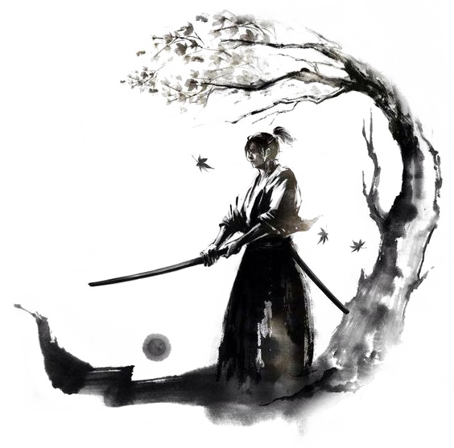

##Repository with solved programming tasks from [Codewars platform](https://www.codewars.com/)

***

Hi, there.
I've created this repository to save and order best practice solutions and track my progress in programming. All solutions have been ordered by programming languages and difficulty levels. Every solution contains my own implementation and best practice code.

[My account and current progress.](https://www.codewars.com/users/Du4b)

***

####!!!ATTENTION SPOILERS!!

CodeWarrior are strongly encouraged not to look at solutions to Kata until they have completed it by themselves or at least took the time to think about their own approaches.
Creating a repository like this is discouraged by Codewars platform.

**C#**

* 7 kui:
  * [Credit Card Mask](C\#/7kui/CreditCardMask/)
  * [Isograms](C\#/7kui/Isograms/)
* 6 kui:
  * [Delete occurrences of an element if it occurs more than n times](C\#/6kui/DeleteOccurrencesOfAnElementIfItOccursMoreThanNTimes/)
  * [Sum of Digits / Digital Root](C\#/6kui/SumOfDigitsOrDigitalRoot/)
  * [Multiples of 3 or 5](C\#/6kui/MultiplesOf3Or5/)
  
  